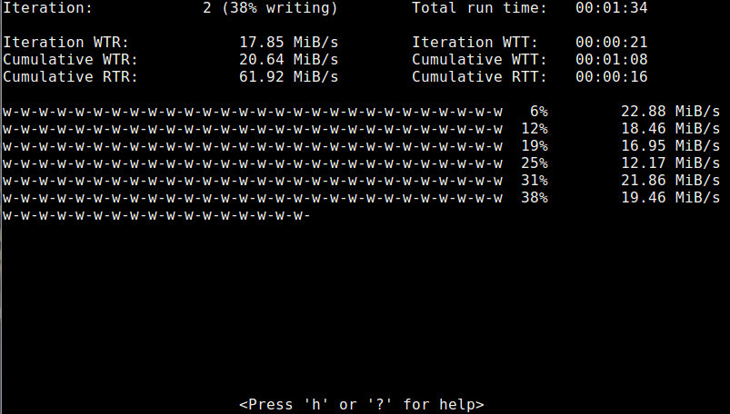

# Spew -- a load generating tool

The spew program is used to test I/O performance and to generate load
on character devices, block devices, and file systems.  It is similar
to the lmdd program found in the lmbench test-suite
(http://www.bitmover.com/lmbench). It is a bit easier to use than lmdd
and has some added functionality.  For example, it can test both
random and sequential I/O.

The spew project is maintained in GitHub.  It can be found at:

   https://github.com/apatters/spew

Spew creates an output and/or input stream and writes and/or reads to
and/or from a file or device. It can be used on both random-access
(disk drives) and sequential-access (tape drives) devices. Various
patterns can be used to test data integrity.

## Spew basic operation

The spew program has three modes, --write, --read, and
--read-after-write (or --raw). The --write mode just writes data to
the file or device. The --read mode reads data from a file. The
--read-after-write mode will write the data then read it back in while
doing data verification.

The spew program can generate both cumulative and semi-instantaneous
transfer-rate statistics. Here is an example of spew being used to
test the sequential transfer rate to a file system:

```
$ spew --pattern=random --min-buffer-size=64k 1g /tmp/bigfile
Write transfer rate:    46677.47 KiB/s    Transfer time: 00:00:22
```

## Spew progress option

You can use the --progress option to display a "progress-meter" that
also shows intermediate transfer rates:

```
$ spew --read-after-write --progress --pattern=numbers \
--min-buffer-size=64k 1g /tmp/bigfile
w-w-w-w-w-w-w-w-w-w-w-w-w-w-w-w-w-w-w-w-w-w-w-w-w-w   6%   198344.51 KiB/s
w-w-w-w-w-w-w-w-w-w-w-w-w-w-w-w-w-w-w-w-w-w-w-w-w-w  12%   180722.66 KiB/s
w-w-w-w-w-w-w-w-w-w-w-w-w-w-w-w-w-w-w-w-w-w-w-w-w-w  19%   180448.48 KiB/s
w-w-w-w-w-w-w-w-w-w-w-w-w-w-w-w-w-w-w-w-w-w-w-w-w-w  25%   180828.37 KiB/s
w-w-w-w-w-w-w-w-w-w-w-w-w-w-w-w-w-w-w-w-w-w-w-w-w-w  31%   175934.15 KiB/s
w-w-w-w-w-w-w-w-w-w-w-w-w-w-w-w-w-w-w-w-w-w-w-w-w-w  38%   176317.55 KiB/s
w-w-w-w-w-w-w-w-w-w-w-w-w-w-w-w-w-w-w-w-w-w-w-w-w-w  44%   176369.75 KiB/s
w-w-w-w-w-w-w-w-w-w-w-w-w-w-w-w-w-w-w-w-w-w-w-w-w-w  50%   175558.53 KiB/s
w-w-w-w-w-w-w-w-w-w-w-w-w-w-w-w-w-w-w-w-w-w-w-w-w-w  56%   175559.94 KiB/s
w-w-w-w-w-w-w-w-w-w-w-w-w-w-w-w-w-w-w-w-w-w-w-w-w-w  62%    33211.64 KiB/s
w-w-w-w-w-w-w-w-w-w-w-w-w-w-w-w-w-w-w-w-w-w-w-w-w-w  69%    18744.87 KiB/s
w-w-w-w-w-w-w-w-w-w-w-w-w-w-w-w-w-w-w-w-w-w-w-w-w-w  75%   171271.02 KiB/s
w-w-w-w-w-w-w-w-w-w-w-w-w-w-w-w-w-w-w-w-w-w-w-w-w-w  81%    14932.66 KiB/s
w-w-w-w-w-w-w-w-w-w-w-w-w-w-w-w-w-w-w-w-w-w-w-w-w-w  88%   169616.72 KiB/s
w-w-w-w-w-w-w-w-w-w-w-w-w-w-w-w-w-w-w-w-w-w-w-w-w-w  94%   170134.11 KiB/s
w-w-w-w-w-w-w-w-w-w-w-w-w-w-w-w-w-w-w-w-w-w-w-w-w-w 100%   171290.72 KiB/s
Write transfer rate:    71438.31 KiB/s    Transfer time: 00:00:14

r-r-r-r-r-r-r-r-r-r-r-r-r-r-r-r-r-r-r-r-r-r-r-r-r-r   6%     5650.53 KiB/s
r-r-r-r-r-r-r-r-r-r-r-r-r-r-r-r-r-r-r-r-r-r-r-r-r-r  12%    42761.38 KiB/s
r-r-r-r-r-r-r-r-r-r-r-r-r-r-r-r-r-r-r-r-r-r-r-r-r-r  19%    51937.35 KiB/s
r-r-r-r-r-r-r-r-r-r-r-r-r-r-r-r-r-r-r-r-r-r-r-r-r-r  25%    46905.78 KiB/s
r-r-r-r-r-r-r-r-r-r-r-r-r-r-r-r-r-r-r-r-r-r-r-r-r-r  31%    50760.52 KiB/s
r-r-r-r-r-r-r-r-r-r-r-r-r-r-r-r-r-r-r-r-r-r-r-r-r-r  38%    46721.39 KiB/s
r-r-r-r-r-r-r-r-r-r-r-r-r-r-r-r-r-r-r-r-r-r-r-r-r-r  44%    52162.35 KiB/s
r-r-r-r-r-r-r-r-r-r-r-r-r-r-r-r-r-r-r-r-r-r-r-r-r-r  50%    38172.26 KiB/s
r-r-r-r-r-r-r-r-r-r-r-r-r-r-r-r-r-r-r-r-r-r-r-r-r-r  56%    41188.34 KiB/s
r-r-r-r-r-r-r-r-r-r-r-r-r-r-r-r-r-r-r-r-r-r-r-r-r-r  62%    47083.10 KiB/s
r-r-r-r-r-r-r-r-r-r-r-r-r-r-r-r-r-r-r-r-r-r-r-r-r-r  69%    51387.36 KiB/s
r-r-r-r-r-r-r-r-r-r-r-r-r-r-r-r-r-r-r-r-r-r-r-r-r-r  75%    48277.87 KiB/s
r-r-r-r-r-r-r-r-r-r-r-r-r-r-r-r-r-r-r-r-r-r-r-r-r-r  81%    48538.21 KiB/s
r-r-r-r-r-r-r-r-r-r-r-r-r-r-r-r-r-r-r-r-r-r-r-r-r-r  88%   123075.07 KiB/s
r-r-r-r-r-r-r-r-r-r-r-r-r-r-r-r-r-r-r-r-r-r-r-r-r-r  94%   179621.55 KiB/s
r-r-r-r-r-r-r-r-r-r-r-r-r-r-r-r-r-r-r-r-r-r-r-r-r-r 100%   176579.31 KiB/s
Read transfer rate:     35313.10 KiB/s    Transfer time: 00:00:29
```

## Spew Terminal User Interface (TUI)

Spew has a terminal user interface that lets you observe its operation
without the need for scrolling. It is especially useful when running
spew with the -i|--iterations option. Here is a screen shot of the
spew TUI in operation:



## Spew -g|--generate--load option

Spew has the -g|--generate load option that combines many commonly used
options together. The command-line syntax then becomes much simpler, eg.,

```
$ spew --raw -g -b 64k 1g /dev/sdb
```

Consult the man-page for details.


## Spew configuration files

You can place command-line defaults in one of three locations,
`/etc/spew.conf`, `$HOME/.spewrc`, or where the environment variable
`$SPEWRC` points.

## Other command-line options

Spew has a lot of different options.  Consult the man-page for more
information.

